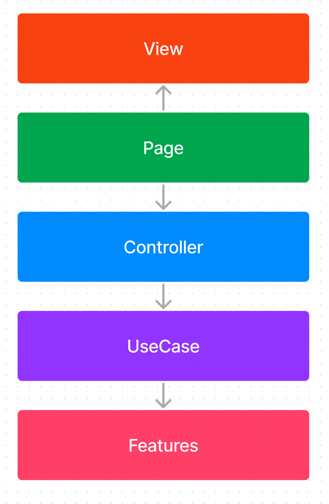

# アーキテクチャ

DJ System iOSのアーキテクチャです

## 概要


## 詳細

各レイヤーの詳細です。


### View

SwiftUIのコンポーネントを定義する

### Page

Controller

### Controller

`UIViewController`のインスタンス

### UseCase

複数のFeatureを横断するロジックを束ねる。

### Features 
各ドメインモデルに依存したコード(例：ドメインロジック・API通信など)を書く。
例でいうとこんな感じ

```
Features
    - Room
    - Music
```

